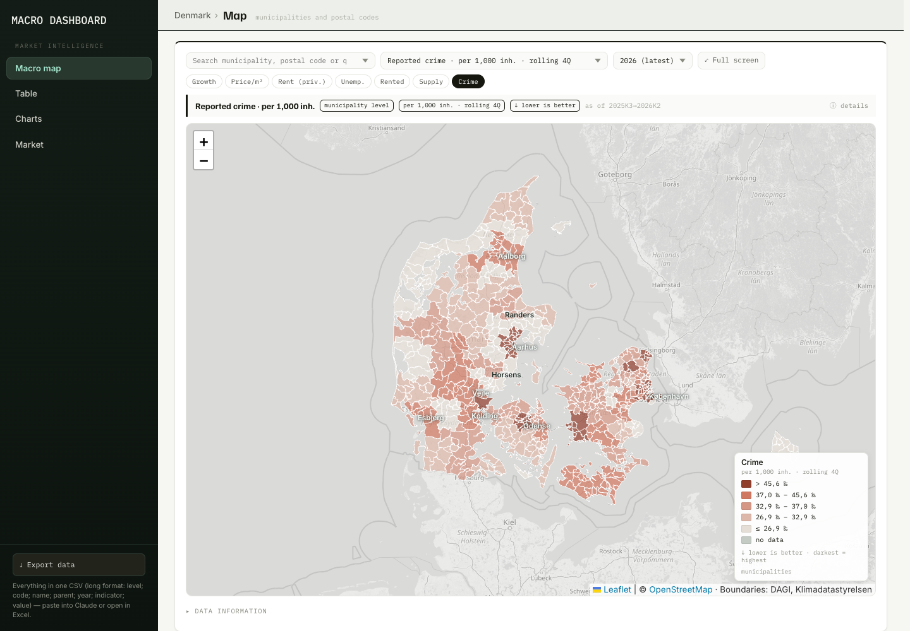
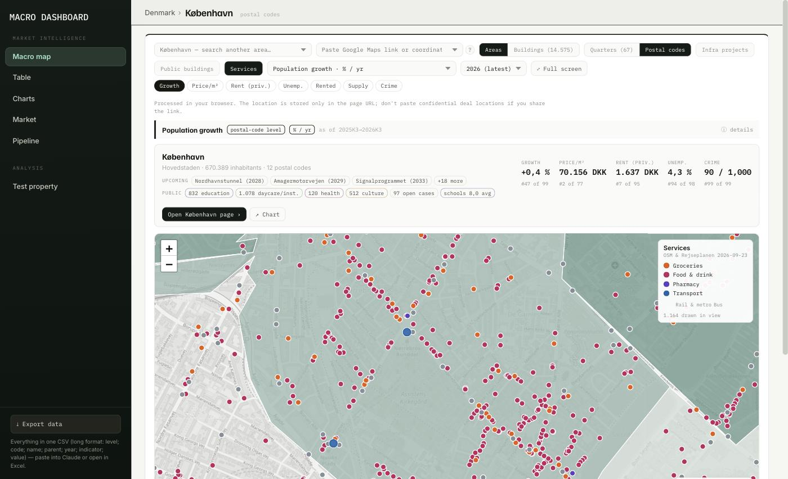

# Macro Dashboard — Denmark (AM dashboard, Danish edition)

**Live:** https://real-estate-war-lord.github.io/am-dashboard-dk/

An open-data market map for residential asset management in Denmark: 36 indicators for all 98 municipalities and ~600 postal-code areas — demographics, income, jobs, housing stock, rents, owner-occupied prices, days on market, supply, construction and safety (reported crime) — plus a national macro panel (CPI, net price index, rent indices, house price index, interest rates, unemployment, GDP, forced sales). Every number comes from a public Danish source and is traceable back to the exact table and period.


## What you get

Four destinations — `Map · Data · Charts · Test property` — and one way of working in all of them:
pick an indicator once and every surface follows it. Interface reference (routes, redirects,
components, export schema, test commands): [`docs/UI_V3.md`](docs/UI_V3.md).

- **Map** (`#map[/<kommune>[/postnr]]`) — choropleth by municipality (five quantile classes, keys-only
  legends bottom right), zoom in for postal codes and Copenhagen quarters. One toolbar row:
  `[search] [Layers ▾] [Indicator ▾] [period]`, quick chips under it, then the info strip (label,
  level, unit, as of, `ⓘ details`). The search box takes an area name, a postal code, a quarter, a
  Google Maps link **or** `lat, lon`. `Layers ▾` holds the three feature layers — Infra projects ·
  Public buildings · Services — with their category filters. Zooming never changes what is selected.
- **Indicator picker and period control** — one component each, on the map, the area page, Data ›
  Areas, Charts and the test property. The picker searches across label, short name, group and unit,
  groups the registry twelve ways, marks `↓ lower is better`, and lists indicators you are only
  seeing because the municipality publishes them under *From the municipality*. The period control
  renders whichever period the indicator actually has: a year, the `Today · 2070 · 2120` horizons,
  a `Projection 2026→2040` badge, or an `as of` badge.
- **Area pages** (`#area/kommune/101` · `#area/postnr/2450` · `#area/kvarter/20101`) — header, five
  headline tiles, the picker, then the **study row**: a chart panel beside a draggable mini map with
  a full-screen `⤢`. The panel draws a line chart with the parent and the peer median, or a peer
  distribution strip when the indicator is a snapshot, or the outlook chart, or three climate
  horizons with the publisher's low–high range. Under it four foldable sections — *Population
  outlook · All figures · Sub-areas · Data information* — whose open state is in the URL.
- **Test property** (`#property?p=<lat>,<lon>[:label]`) — paste a Google Maps link or a `lat, lon`
  pair and read one address against every layer: the same study row pointed at the pin's finest
  published area (quarter > postal code > municipality, named as a `read as` tag), its own
  `Layers ▾`, a radius select (500 m · 1 km · 2 km · 5 km) that drives both the ring on the map and
  the counts below, and eight foldable sections — outlook, area profile, safety, infrastructure
  nearby, public buildings and schools inside the ring, climate, sources. The link is the state and
  the location never leaves the browser.
- **Data** — the tabular home of every dataset, with `Export ▾` in its header.
  *Areas* (`#data/areas/<level>`): every municipality, postal code or quarter side by side, filtered
  by search, region and minimum population, sorted by the active indicator's column.
  *Projects* (`#data/projects`): the infrastructure pipeline with its filters.
  *National series* (`#data/national`): the 13 macro series as a table — latest, period, y/y, source,
  a five-year sparkline — with four headline tiles above it.
  *Sources* (`#data/sources`): every source with its publisher, tables, as-of, fetch date, licence
  and what it feeds. This table is generated from the same rows the sources CSV writes.
- **Charts** (`#charts?…`) — indicator × areas × years, median and Denmark reference lines, PNG and
  CSV export, shareable URL. A Climate indicator plots the three horizons as bars with range
  whiskers; an Outlook one goes dashed and purple after the last observed year.
- **Housing stock from BBR** — the building register aggregated per postal code and Copenhagen
  quarter: tenure, unoccupied share, sizes, age, building type (a free Datafordeler key is needed to
  refresh; the aggregated file is committed).
- **Buildings** — inside a municipality, every residential building with 2+ dwellings as a dot:
  address, BFE number, tenure, size, year built, rooms. Loaded per municipality on demand.
- **Detail sheets** — project, public building, school and climate, each reached from the content
  rather than from the nav, each with a tile row, a mini map and its sources.

### Navigation and URLs

```
MACRO DASHBOARD
 MARKET INTELLIGENCE
  Map            #map[/<kommune>[/postnr]]
  Data           #data/areas/<level> · #data/projects · #data/national · #data/sources
  Charts         #charts?…
 ANALYSIS
  Test property  #property?p=<lat>,<lon>[:label]
 ── footer ──  Export ▾ · built <date> · v3.0
```

Below 1025 px the sidebar becomes a 52 px top bar with a `☰` drawer and the page scrolls natively.

The URL is the state, and a key is written only when it differs from the default: `ind` (indicator),
`y` (year) or `hz` (`today|2070|2120`), `lay` (feature layers), `zones=0`, `p` (the pin), `rad`
(radius), `show` (which sections are open), plus each view's own filters. `hashFor()` is the only
serialiser and `parseHash()` the only parser, so *Copy link* always reproduces exactly what you see.

**Every v2.6 link still works.** `#table/<level>` → `#data/areas/<level>`, `#pipeline` →
`#data/projects`, `#market` → `#data/national`, `#market?src=1` and `#sources` → `#data/sources`,
`#analysis?a=&la=` → `#property?p=`, `#compare?a=&b=` → the first area's own page, the old
`infra=1&public=1&services=1` flags → `lay=`, `climate=1` → the storm-surge indicator, `t=`/`g=` →
`show=`. Each redirect is a test that runs at four viewports on every build.

### Export

`Export ▾` sits in the sidebar footer, the Data header and the test-property header. Seven files,
and **every row carries its source, table id, verify URL, as of, fetched date and licence**:

| Item | File |
|---|---|
| This view (CSV) | `<view>_<date>.csv` — what is on screen, wide, provenance in each column header |
| All area data | `areas_long_<date>.csv` — 104 028 rows: 3 levels × every indicator × every published period |
| Projects | `projects_<date>.csv` — own schema, never mixed into indicator columns |
| National series | `national_series_<date>.csv` |
| Sources catalogue | `sources_<date>.csv` |
| Climate exposure | `climate_exposure_<date>.csv` — level × horizon |
| Test property | `test_property_<date>.csv` + `test_property_nearby_<date>.csv` |

Long schema: `level, code, name, parent_code, parent_name, region, population, indicator, label,
unit, period, period_type, value, value_type, inherited_from, direction, source, table_id,
source_url, as_of, fetched, licence`. `period_type` ∈ `year | quarter | month | school_year | window
| snapshot | horizon | projection`; `value_type` ∈ `actual | projection | inherited | derived`, with
`inherited_from` naming the municipality a figure was read down from. UTF-8 with BOM, `;` separator,
`.` decimals, no thousands grouping — Danish Excel opens every file by double-click.

### Numbers, and how a figure says what it is

- `da-DK` on screen (`70.156 DKK`, `+0,4 pp`), `.` decimals and no grouping in every CSV.
- A change of a share is `pp`, a change of a level is `%`.
- Rank is `#n of N` everywhere, and the `title` says which peers ("of 77 municipalities with a
  figure").
- `–` means the publisher has no figure; `n/c` means it is not computed at this level. Never `0`.
- A **projection** is purple, dashed, and carries a `Projection` pill — it can never be mistaken for
  an actual. A **climate** figure is blue and always names both calendars (the zone's year and the
  Klimaatlas period).
- A figure the area does not publish itself is dimmed and labelled **municipality figure** on a tile,
  tagged **muni** in a table, and listed under *From the municipality* in the picker.

### Safety

Reported crime from Statistics Denmark (STRAF11, quarterly from 2007; STRAF22, annual) per municipality, by place of offence: all penal-code offences, violence, property crime and drug/weapons offences per 1,000 inhabitants, residential burglaries per 1,000 dwellings, the year-on-year change, and the share of penal-code reports that led to a charge. Counts are summed over the latest four quarters (they are not seasonally adjusted), ranks read "lower is better", and postal codes and Copenhagen quarters show their municipality's value (°) — there is no open crime statistic below municipality level. Charts show the full series from 2007, yearly or quarterly, against Denmark as a whole, with the 2013 change in the sexual-offence rules marked. Copenhagen's 67 quarters carry their own figures from Københavns Kommunes Tryghedsundersøgelse (reported crime per 1,000 inhabitants and the share of residents feeling safe in their neighbourhood, published per bydel, marked `^`). Reported ≠ solved, and drug/weapons figures mostly reflect police activity; see [`docs/DATA_MAP.md` §3.8](docs/DATA_MAP.md).



### Infrastructure pipeline

An *Infra projects* overlay on the map: 51 curated projects that will change accessibility — metro and light rail, motorways, bridges and tunnels, hospitals, BRT lines, campuses, state buildings and urban-development areas. Line style shows the status (study · decided · under construction · opened), a click opens the project's datasheet with its budget, opening year, length and the areas it serves, and **Data › Projects** lists them all with filters and CSV export. Area cards show the three nearest upcoming projects. Budgets and years come from each project's own official source and are left empty when that source does not state them; geometry drawn by hand is marked as a schematic corridor. Method and sources: [`docs/INFRA.md`](docs/INFRA.md).


### Public buildings

A second overlay draws the public building stock from BBR: schools, daycare, institutions, health and culture buildings, coloured by category, with floor area, year built and address. Buildings with an **open building case** (permit ≤ 3 years) are drawn hollow and dashed — BBR's case data carries almost no completion dates, so the layer reports case activity, never a construction schedule. The legend doubles as a filter (category, existing vs open case) and the filter is part of the URL. Area cards gain a **PUBLIC** line whose segments open a filtered list. **Coverage: the Copenhagen metro set — København and 18 suburban municipalities, 7 517 buildings; other municipalities to follow.** Method and caveats: [`docs/PUBLIC_BUILDINGS.md`](docs/PUBLIC_BUILDINGS.md).


### School quality

Every Education building that sits on a school's site carries that school's figures from **Uddannelsesstatistik.dk**: the FP9 grade average shown against its own municipality and against Denmark, the **socioeconomic reference** — the grade the ministry's model expects from the pupils' background — and whether the gap is statistically significant, pupil well-being, pupils and class size, over the three latest school years. A school datasheet gives the three-year table, the benchmarks, the four well-being sub-indicators and the buildings on its site. Filter the public layer down to **Education alone** and the markers switch to a five-step grade ramp with a matching legend; a school that publishes no grade — no 9th grade, or a cell the source suppressed — keeps the plain Education hue with a thin outline rather than the bottom bin, because those are not low-scoring schools. 364 schools in the Copenhagen metro set, 96 % of them placed on a BBR building. A grade average mostly tracks intake, which is exactly why the socioeconomic reference sits next to it everywhere it appears. Method, cube codes and the discretion rules: [`docs/SCHOOLS.md`](docs/SCHOOLS.md).


### Test property — one address against every layer

Paste a Google Maps link — or a plain `55.67610, 12.56830` — into the map's search box or into the box at the top of **Test property**, and the dashboard pins that point, drills to its municipality at postal-code level and draws 500 / 1 000 / 1 200 m rings around it; *Open as test property* opens **`#property?p=<lat>,<lon>[:label]`**, one address read against every layer at once: where it is (kommune · postal code · Copenhagen quarter, from the kommune's own boundary rings rather than from its postal code, so a Frederiksberg address is not labelled København), the full area profile with a direction-aware percentile bar against every area of the same level, safety, every infrastructure project within 3 km with its distance **computed from the geometry** — a station point, the nearest point of a line, 0 m inside a development area — the public buildings and schools inside the radius you choose (500 m · 1 km · 2 km · 5 km) including the ones across a municipality border, and a sources section built from what that pin actually read. The mini map drags, zooms and goes full screen, and carries the same layers as the Macro map through the same `Layers ▾` menu; its choropleth follows whichever indicator the picker — or a click on a headline tile — names. The link is the state: `&ind=`, `&lay=`, `&rad=`, `&show=` and the pin itself travel in it, so *Copy link* reproduces the view and Back returns to the map with the pin intact. It all runs in the browser — the link is parsed, never followed, which is also why short `maps.app.goo.gl` links are refused by name instead of guessed at, and why the box says the location is stored only in the page URL. **Coverage: national, except public buildings and schools (Copenhagen metro set).** Method, formats, distances and caveats: [`docs/ANALYSIS.md`](docs/ANALYSIS.md).


### Services — shops, food, pharmacies and transport stops

A third map overlay beside *Infra projects* and *Public buildings*: **44 181 points across all 99 municipalities** — groceries, restaurants/cafés/bars/takeaway, pharmacies, and every metro, S-train, rail, light-rail and bus stop in the national timetable. Shops and eating places come from the **Geofabrik OpenStreetMap extract** (nodes *and* building polygons — 46 % of Danish supermarkets are mapped as a polygon, so a node-only read loses half of them); stops come from **Rejseplanen's static GTFS**, with the modes resolved through `stops → stop_times → trips → routes` because `stops.txt` does not carry them, and platforms clustered into stations by name and mode because the feed ships no station hierarchy at all. The legend doubles as the filter — Groceries · Food & drink · Pharmacy · Transport, the last split into *Rail & metro* and *Bus* — and the filter travels in the URL. Performance is the shape of the thing: each category has a zoom floor (rail & metro from 10, groceries and pharmacies from 13, food and buses from 14) with a *"Zoom in to see …"* hint below it, only the viewport is drawn, and per-municipality files load only for bounding boxes actually in view. Worst case measured — zoom 14 over Nørrebro with every category on — is 3 346 markers rebuilt in 15.6 ms, so there is no clustering library and no CDN dependency. **Coverage is national, but OpenStreetMap density is not uniform: an empty rural postal code may mean "nothing mapped", not "nothing there"**, which is why there are no area-level service indicators. Method, licences and caveats: [`docs/SERVICES.md`](docs/SERVICES.md); how the sources were chosen: [`docs/SERVICES_PROBE.md`](docs/SERVICES_PROBE.md).



### Climate risk — storm surge, sea level, rainfall

A fourth map overlay: **Kystdirektoratet's own published 100-year flood extents** for **2020, 2070 and 2120**, the **26 designated flood risk areas** from the Floods Directive's 2024 screening, and **eight climate indicators** from **DMI Klimaatlas v2025a** — mean sea level rise, the 100-year storm-surge level, how much more often today's 100-year level recurs, 100-year hourly rainfall, cloudbursts per year, insurers' weather-damage claims, the risk-area designation, and the share of dwellings inside the extent. One pill (*Today · 2070 · 2120*) drives the drawn zones **and** every indicator value, and every label names both calendars, because they are not the same one: at 2120 the zone is Kystdirektoratet's 2120 extent while the figures are Klimaatlas's **2071–2100** period, the latest it publishes. Klimaatlas gives the sea figures per **coastal stretch**, so a municipality takes the stretch it shares the longest coastline with — 25 m samples, majority wins — and every other stretch it touches is **named beside the figure, never averaged into it**; a maximum of two published figures is a figure nobody published. Dwellings inside a zone are counted from their **BBR building point allowing 5 m**, for municipalities, postal codes and Copenhagen quarters at all three horizons, and the count runs on the raw polygons even though the drawn ones are simplified. Landlocked municipalities are grey and say *not coastal* rather than showing a zero, and never take a rank. The zones are drawn in a pane that takes **no pointer events at all**, so a fill covering half a municipality can never swallow the click that opens it — what the extent knows about the clicked point goes into that same popup instead. **This is screening data for comparing areas: it carries no depth, and it is not a property-level flood assessment** — it knows nothing about a dike, a pump or a floor level. Every figure links to the publisher's own query, and `scripts/verify_climate.py` re-checks the whole layer against the live sources without importing a line of the pipeline. Method, licences, horizons and caveats: [`docs/CLIMATE.md`](docs/CLIMATE.md).

### Population outlook

Where a municipality — or a Copenhagen quarter — is **projected** to be in 2040, from the publishers' own runs. Ten indicators per area from **Danmarks Statistik's `FRKM126`** (2026 vintage): total growth to 2040 and to 2031, the change per 1 000 inhabitants per year, the absolute change in persons, and the 0–5, 6–16, 20–34 and 80+ cohorts, with 20–34 also shown **against Denmark's own −7.1 %** — because the national cohort shrinks over the window, only 7 of 98 municipalities gain any at all, and the relative map is the one that reads. Copenhagen's 67 quarters get the same ten again from **Københavns Kommune's own `KKFR2026`**, kept in its own file and its own view: the two runs are **never spliced**, and where both describe the same city the gap is stated (DST +5.9 %, KK +8.3 % by 2040) rather than averaged away. Beside them sits **net dwelling additions** from `BOL101` — what the stock actually did, a measurement, in its own unit, with nothing computed between the two. The colour model is diverging and centred on zero because growth and decline are different phenomena, and the indicators carry a `neutral` direction: a shrinking municipality is not failing, so nothing here is coloured good-to-bad or ranked best-to-worst. Area pages show the observed population as a solid line and the projection dashed to 2040 with a *today* marker, so a projected point never reads as an actual; Copenhagen quarters add one line of the forecast's own past accuracy. **Projections are scenarios, not guarantees** — and the housing-gap indicator that would have needed an assumption of ours is deliberately not here. Method, sources and what is excluded: [`docs/FORECAST.md`](docs/FORECAST.md).


## Data sources (all free, no key unless noted)

| layer | source | tables |
|---|---|---|
| Population, households, income, unemployment, education, ancestry, housing stock, housing benefit, construction | Statistics Denmark, StatBank API | FOLK1A, POSTNR1, FAM55N, INDKP101, IFOR22, AUP01, HFUDD11, FOLK1E, BOL101, BOL106, BOST63, BYGV33 |
| Realised prices DKK/m², asking-price discount, days on market, homes for sale | Finans Danmark, Boligmarkedsstatistikken (via `api.statbank.dk/v1/s20`) | BM010, BM011, BM030, BM031, UDB010 |
| Private rental rent DKK/m²/yr | Social- og Boligstyrelsen, boligstat.dk (housing-benefit register × BBR) | Huslejestatistik 2026 |
| Social housing rent DKK/m²/yr | Landsbyggefonden, Huslejestatistik 2026 | Tabel 7 |
| Reported crime (place of offence) and charges | Statistics Denmark, StatBank API | STRAF11, STRAF22 |
| Infrastructure projects: alignments (Greater Copenhagen) | Plan- og Landdistriktsstyrelsen, Fingerplan 2019 (WFS) | metro, letbane, rail, motorway and study corridors |
| Infrastructure projects: budgets and opening years | Transportministeriet, *Status for anlægs- og byggeprojekter* (Anlægsstatus) | half-yearly PDF |
| Hospitals, BRT, campuses, state buildings | the regions, Movia, Vejdirektoratet, municipalities, Bygningsstyrelsen | project pages, agendas and annual reports |
| Infrastructure geometry outside Greater Copenhagen | OpenStreetMap via Overpass | © OpenStreetMap contributors (ODbL) |
| Public buildings (schools, daycare, health, culture) | BBR via Datafordeler (free API key) | anvendelse 410–449; addresses from DAR; names from OpenStreetMap |
| School quality: FP9 grades, socioeconomic reference, well-being, pupils, class size | Børne- og Undervisningsministeriet / STIL, Uddannelsesstatistik.dk (free API key) | GS cubes KARA/KARAGNS, KARA/KARADM, TRIV/TRIVIND, ELEV/ELEVEX, OVER/OVERSKO; Institutionsregisteret for location and type |
| Copenhagen quarters: reported crime and feeling safe, per bydel | Københavns Kommune, Tryghedsundersøgelsen (Epinion) / Københavns Politi | annual report (PDF) |
| Macro series | Statistics Denmark incl. Danmarks Nationalbank mirrors | PRIS01, PRIS04, HUS1, EJ56, DNRENTM, AUS07, NKN1, TVANG1 |
| Boundaries | Klimadatastyrelsen, DAGI (via DAWA, vendored 2026-09-14) | kommuner, postnumre, sogne |

Full catalogue, indicator mapping and verification log: [`docs/DATA_MAP.md`](docs/DATA_MAP.md).

## Run it yourself

Python 3.10+, no packages required (`shapely` and `openpyxl` optional for geometry and the LBF import).

```bash
git clone https://github.com/real-estate-war-lord/am-dashboard-dk.git && cd am-dashboard-dk
make validate   # every table/value code against the live API + a 2-area sample of source links
make fetch      # ~36 pulls to data/raw (no key)
make build      # raw → data/processed → dist/index.html
make serve      # http://localhost:8080
make test       # unit tests (python + node --test)
make smoke      # UI: every route × 4 viewports — landmarks, redirects, 0 JS errors, 0 overflow
make ac         # UI: the v3.0 acceptance suite, one check per spec criterion
make links      # full source-link sweep: all 165 Outlook links (slow, ~15 min — not in make validate)
```

`make smoke` and `make ac` need a server on :8080 (`make serve`); both check the page title first and
serve `dist/` themselves if something else owns that port. They are the UI's regression net: 38
routes at 1440×900, 1536×864, 1366×768 and 390×844, every v2.6 redirect among them, and one
acceptance check per criterion in [`docs/v3/UI_SPEC_v3.md`](docs/v3/UI_SPEC_v3.md). See
[`docs/UI_V3.md`](docs/UI_V3.md) §6 for the raw commands and their flags.

`make validate` is the pre-commit check and stays quick. The **full** source-link sweep —
every one of the 98 municipalities and 67 Copenhagen quarters fetched and its displayed value
recomputed from the response — is `make links`, run before a release rather than on every edit.

`make geo` re-vendors boundaries (DAWA closed 2026-10-01 — see `docs/GEO.md` for the Datafordeler route). Rents are updated yearly with `scripts/import_lbf.py` and `scripts/import_boligstat.py` (see `data/external/SOURCES.md`).

Every push to `main` rebuilds and deploys to GitHub Pages; on the 3rd of each month the workflow also refreshes the data.

## Documentation

- `docs/DATA_VERIFICATION_GUIDE.pdf` — every indicator, its source table and codes, the computation, one-click links that reproduce the source cells, and a worked re-check of 28 figures against the live sources (22 Sep 2026).

| doc | read it when |
|---|---|
| [`docs/UI_V3.md`](docs/UI_V3.md) | the interface — routes and redirects, URL keys, components, export schema, the responsive matrix, the test commands |
| [`docs/RUNBOOK.md`](docs/RUNBOOK.md) | you are about to run something — steps, expected output, troubleshooting |
| [`docs/DATA_FOLDERS.md`](docs/DATA_FOLDERS.md) | where a file belongs, what is committed, how a number is traced to its source |
| [`docs/DATA_MAP.md`](docs/DATA_MAP.md) | source catalogue, Finnish → Danish indicator mapping, verification log |
| [`docs/BUILD_PLAN.md`](docs/BUILD_PLAN.md) | phases done and the roadmap |
| [`docs/SCHOOLS.md`](docs/SCHOOLS.md) | school quality — cube codes, the BBR join, discretion rules, cadence |
| [`docs/ANALYSIS.md`](docs/ANALYSIS.md) | the test-property pin — link formats, kommune resolution, distances, coverage, privacy |
| [`docs/SERVICES.md`](docs/SERVICES.md) | the services layer — sources, categories, zoom floors, clustering rules, refresh |
| [`docs/CLIMATE.md`](docs/CLIMATE.md) | the climate risk layer — sources, the two calendars, the coast and risk-area rules, exposure, what was left out |
| [`docs/FORECAST.md`](docs/FORECAST.md) | the population outlook — sources, the hard-data rule, what is shown and what is research |
| [`docs/GEO.md`](docs/GEO.md) | boundary pipeline |
| [`CHANGELOG.md`](CHANGELOG.md) | what changed in which version |

`config/indicators.json` is the single registry: key, label, unit, table, query, calculation, native geography, colour. Adding an indicator is one entry there — no code changes.

## Design

The UI is a port of a Finnish asset-management dashboard's market section: same palette, typography, choropleth colour model and interaction pattern, rebuilt in English for Danish data. Leaflet (BSD-2) for the map, OpenStreetMap tiles.

## Caveats worth knowing

- Rent levels come from housing-benefit households and skew low; market asking rents are typically higher.
- Cooperative dwellings (andelsboliger) count as rented in DST's tenure statistic.
- Finans Danmark suppresses cells with few trades; small municipalities and most rural postal codes show no price.
- Street-level postal codes in central Copenhagen (1000–1999) are merged by name.
- Copenhagen quarters (kvarterer) use Københavns Kommune's own statbank (`s30`); unemployment there exists only per district (bydel) and is repeated on each quarter of the district.
- Copenhagen quarter crime and safety figures come from the city's own annual survey (police figures for the previous calendar year), so they are not comparable with the national crime indicators.
- The public-buildings layer covers the Copenhagen metro set only, and BBR is owner-reported: floor area, use and status are as reported, not as surveyed. An open building case is not a construction schedule.
- The outlook is a projection, not a measurement: it carries each area's recent fertility, mortality and migration forward and contains no housing programme, so a large planned development is not in it. DST's run and Københavns Kommune's run disagree by 2.2 % for Copenhagen by 2040 and are never combined.
- The services layer is as complete as OpenStreetMap is in that place, and that varies: Copenhagen is densely mapped, rural Jutland is not. Transport stops are the live timetable, so a stop is where you can catch something, not how often.
- The test property's distances are to mapped geometry, not walking routes, and its infra list is the curated layer — an existing station that is not a project in it will not appear. Short `maps.app.goo.gl` links cannot be resolved in a browser; paste the long URL.
- The infrastructure layer is a curated list, not a register: it holds the projects named in `docs/INFRA.md` and nothing else, and ten of its geometries are schematic corridors drawn by hand.
- Crime figures are reported offences by place of offence, per municipality only; they exclude the traffic law, break in 2007 and on 1 July 2013 (sexual offences), and DST writes suppressed cells as 0, so a zero on a small island may be suppressed.

## Licence and attribution

Code: MIT. Data: each source's own terms (all permit reuse with attribution). When you reuse the data or the map, credit: *Danmarks Statistik (incl. crime statistics STRAF11/STRAF22) · Indeholder data fra Klimadatastyrelsen (BBR, DAR) · Københavns Kommune, Tryghedsundersøgelsen / Københavns Politi · Plan- og Landdistriktsstyrelsen (Fingerplan 2019) · Transportministeriet (Anlægsstatus) · the regions, Movia and Bygningsstyrelsen for their own projects · © OpenStreetMap contributors (ODbL) · Finans Danmark, Boligmarkedsstatistikken · Social- og Boligstyrelsen, boligstat.dk · Landsbyggefonden · Indeholder data fra Klimadatastyrelsen (DAGI) · Danmarks Nationalbank · Kilde: Uddannelsesstatistik.dk (Børne- og Undervisningsministeriet / STIL), retrieved 2026-09-23 · Institutionsregisteret, STIL · Danmarks Statistik FRKM126 / FRDK126 (municipal population projection) · Københavns Kommune KKFR2026 (befolkningsfremskrivning).*

The services layer adds two of its own, carried on every popup, in the map footer while the layer is on, and in Data › Sources:

- **© OpenStreetMap contributors, ODbL** — shops, eating places and pharmacies (Denmark extract processed by Geofabrik GmbH)
- **Rejseplanen, CC BY 4.0** — metro, S-train, rail, light-rail and bus stops

The climate risk layer adds four more, carried on every popup, on the climate sheet and in the legend:

- **Contains data from the Danish Meteorological Institute** (*Indeholder data fra DMI*) — Klimaatlas v2025a, sea level, storm surge, rainfall and cloudbursts
- **Kystdirektoratet, Kystplanlægger oversvømmelsesfare** — the published 100-year flood extents, always named with their year (2020 / 2070 / 2120)
- **Miljøstyrelsen / Kystdirektoratet, risikoområder (oversvømmelsesdirektivet 2024)** — the 26 designated flood risk areas
- **Forsikring & Pension, vejrskader** (charts `TUJ9b` / `z0zEO`, version 4, fetched 2026-09-23) — weather-damage claims. F&P states **no licence**, so the figures are treated as a dated, versioned snapshot with attribution rather than as a feed

To cite: *AM Dashboard — Denmark Edition, v1.0 (2026), https://github.com/real-estate-war-lord/am-dashboard-dk.*
