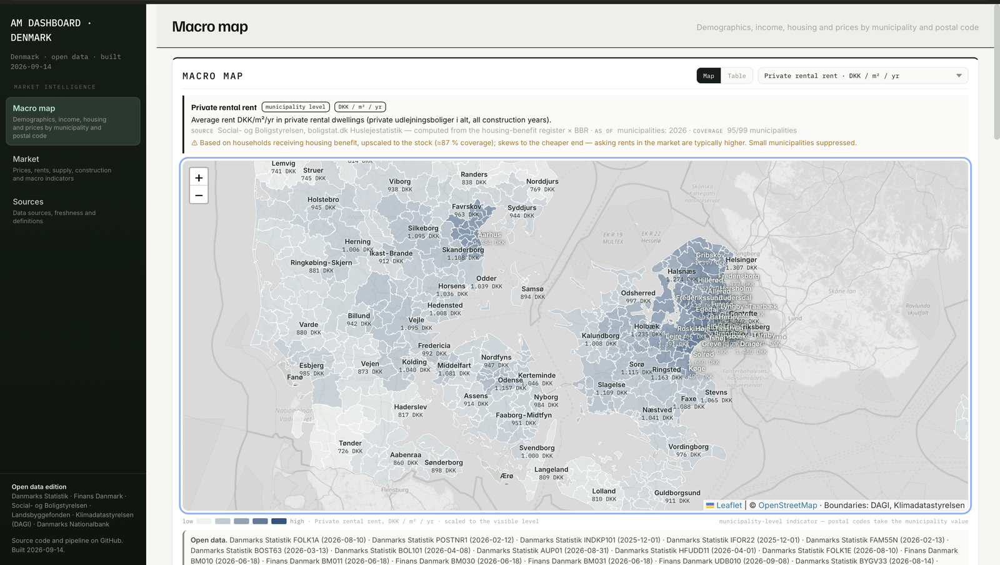

# Macro Dashboard — Denmark (AM dashboard, Danish edition)

**Live:** https://real-estate-war-lord.github.io/am-dashboard-dk/

An open-data market map for residential asset management in Denmark: 20 indicators for all 98 municipalities and ~600 postal-code areas — demographics, income, jobs, housing stock, rents, owner-occupied prices, days on market, supply and construction — plus a national macro panel (CPI, net price index, rent indices, house price index, interest rates, unemployment, GDP, forced sales). Every number comes from a public Danish source and is traceable back to the exact table and period.



## What you get

- **Macro map** — choropleth by municipality (five quintile colour classes, legend on the map), zoom in for postal codes (and Copenhagen quarters); breadcrumb navigation, area search, grouped indicator selector with quick chips and a folded explanation (definition, source table, period, coverage, caveats), year selector 2016–2026. Popups show the selected indicator with its rank and four headline figures, link to the area page, the buildings layer and the chart generator, and fold all values underneath.
- **Area pages** — every municipality, postal code and Copenhagen quarter has its own page (`#area/<type>/<code>`): headline row (five key figures with y/y and rank), key-figure tiles by theme with sparklines against the median; trend chart vs municipality and median; context map with clickable neighbours; tabs for all indicators, the BBR housing stock and sub-areas; ↗ opens any figure in Charts.
- **Table** — everything side by side (municipalities / postal codes / quarters) with search, region filter, minimum population, sorting and CSV export.
- **Housing stock from BBR** — the building register itself, aggregated per postal code and Copenhagen quarter: tenure, unoccupied share, sizes, age, building type (free Datafordeler API key needed to refresh; the aggregated file is committed).
- **Buildings (Micro)** — inside a municipality, every residential building with 2+ dwellings as a dot: address, BFE property number, tenure, size, year built, rooms; find by address, filter and export. Loaded per municipality on demand.
- **Charts** — chart generator: indicator × areas × years, median line, PNG and CSV export, shareable URL.
- **Export data** (sidebar) — one long-format CSV of every level, indicator and year plus the macro series, ready for analysis in Claude, Python or Excel.
- **Market** — KPI tiles and series for the national picture.
- **Sources** — folded under Market: every table with its "updated" stamp, plus indicator definitions.

## Data sources (all free, no key unless noted)

| layer | source | tables |
|---|---|---|
| Population, households, income, unemployment, education, ancestry, housing stock, housing benefit, construction | Statistics Denmark, StatBank API | FOLK1A, POSTNR1, FAM55N, INDKP101, IFOR22, AUP01, HFUDD11, FOLK1E, BOL101, BOL106, BOST63, BYGV33 |
| Realised prices DKK/m², asking-price discount, days on market, homes for sale | Finans Danmark, Boligmarkedsstatistikken (via `api.statbank.dk/v1/s20`) | BM010, BM011, BM030, BM031, UDB010 |
| Private rental rent DKK/m²/yr | Social- og Boligstyrelsen, boligstat.dk (housing-benefit register × BBR) | Huslejestatistik 2026 |
| Social housing rent DKK/m²/yr | Landsbyggefonden, Huslejestatistik 2026 | Tabel 7 |
| Macro series | Statistics Denmark incl. Danmarks Nationalbank mirrors | PRIS01, PRIS04, HUS1, EJ56, DNRENTM, AUS07, NKN1, TVANG1 |
| Boundaries | Klimadatastyrelsen, DAGI (via DAWA, vendored 2026-09-14) | kommuner, postnumre, sogne |

Full catalogue, indicator mapping and verification log: [`docs/DATA_MAP.md`](docs/DATA_MAP.md).

## Run it yourself

Python 3.10+, no packages required (`shapely` and `openpyxl` optional for geometry and the LBF import).

```bash
git clone https://github.com/real-estate-war-lord/am-dashboard-dk.git && cd am-dashboard-dk
make validate   # check every table/value code against the live API
make fetch      # ~36 pulls to data/raw (no key)
make build      # raw → data/processed → dist/index.html
make serve      # http://localhost:8080
```

`make geo` re-vendors boundaries (DAWA closed 2026-10-01 — see `docs/GEO.md` for the Datafordeler route). Rents are updated yearly with `scripts/import_lbf.py` and `scripts/import_boligstat.py` (see `data/external/SOURCES.md`).

Every push to `main` rebuilds and deploys to GitHub Pages; on the 3rd of each month the workflow also refreshes the data.

## Documentation

| doc | read it when |
|---|---|
| [`docs/RUNBOOK.md`](docs/RUNBOOK.md) | you are about to run something — steps, expected output, troubleshooting |
| [`docs/DATA_FOLDERS.md`](docs/DATA_FOLDERS.md) | where a file belongs, what is committed, how a number is traced to its source |
| [`docs/DATA_MAP.md`](docs/DATA_MAP.md) | source catalogue, Finnish → Danish indicator mapping, verification log |
| [`docs/BUILD_PLAN.md`](docs/BUILD_PLAN.md) | phases done and the roadmap |
| [`docs/GEO.md`](docs/GEO.md) | boundary pipeline |
| [`CHANGELOG.md`](CHANGELOG.md) | what changed in which version |

`config/indicators.json` is the single registry: key, label, unit, table, query, calculation, native geography, colour. Adding an indicator is one entry there — no code changes.

## Design

The UI is a port of a Finnish asset-management dashboard's market section: same palette, typography, choropleth colour model and interaction pattern, rebuilt in English for Danish data. Leaflet (BSD-2) for the map, OpenStreetMap tiles.

## Caveats worth knowing

- Rent levels come from housing-benefit households and skew low; market asking rents are typically higher.
- Cooperative dwellings (andelsboliger) count as rented in DST's tenure statistic.
- Finans Danmark suppresses cells with few trades; small municipalities and most rural postal codes show no price.
- Street-level postal codes in central Copenhagen (1000–1999) are merged by name.
- Copenhagen quarters (kvarterer) use Københavns Kommune's own statbank (`s30`); unemployment there exists only per district (bydel) and is repeated on each quarter of the district.

## Licence and attribution

Code: MIT. Data: each source's own terms (all permit reuse with attribution). When you reuse the data or the map, credit: *Danmarks Statistik · Finans Danmark, Boligmarkedsstatistikken · Social- og Boligstyrelsen, boligstat.dk · Landsbyggefonden · Indeholder data fra Klimadatastyrelsen (DAGI) · Danmarks Nationalbank.*

To cite: *AM Dashboard — Denmark Edition, v1.0 (2026), https://github.com/real-estate-war-lord/am-dashboard-dk.*
